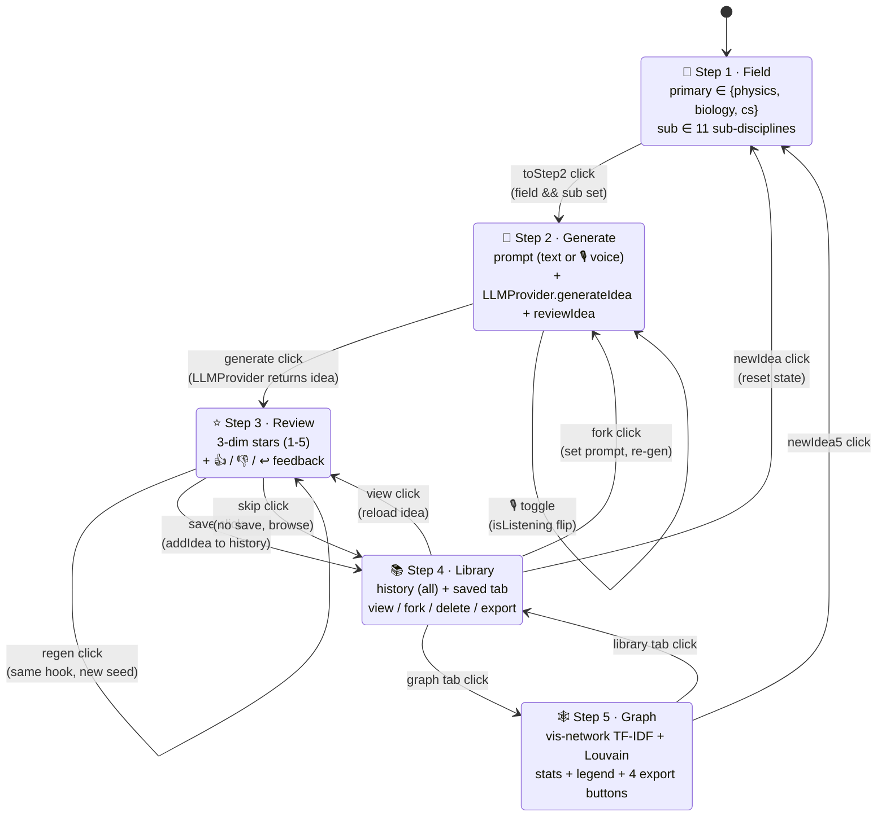
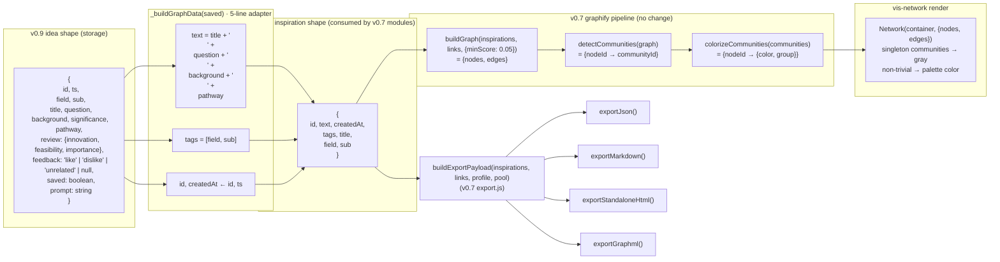

# IdeaMiner v0.9 — Architecture Report

> **v0.9 = v0.5 复现 + v0.7 graphify + v0.8 输入 — strung together.**
> 本地优先 SPA, 一个 repo 两个 SPA 旁开 (`./` 是 v0.7 InsightRecoder, `./v0.8-ideaminer/` 是 v0.9 IdeaMiner)。

**Repo:** `https://github.com/DarrenWongKaWa/ideaminer-mvp`
**Live URL (when cert issues):** `https://darrenwongkakawa.github.io/ideaminer-mvp/v0.8-ideaminer/index.html`
**Local fallback:** `python3 -m http.server 8080` 在 repo 根 → `http://127.0.0.1:8080/v0.8-ideaminer/index.html`

---

## 0. 一句话

> **5 步走**: 选领域 → (打字 / 说话 描述直觉) → 生成 4 段式研究想法 → 3 维评分 + 👍👎↩ → 入库 / 在 TF-IDF + Louvain 图上看到 idea 之间的隐式连接 → 一键 4 格式导出 (JSON / MD / HTML / GraphML)。

## 1. 总体架构图

```mermaid
flowchart TB
    subgraph UI["<b>UI layer</b> · 5-tab bottom nav"]
        T1[🎯 Step 1<br/>Field pick]
        T2[🧪 Step 2<br/>Generate<br/>text + voice]
        T3[⭐ Step 3<br/>Review<br/>3-dim stars]
        T4[📚 Step 4<br/>Library<br/>+ Export]
        T5[🕸 Step 5<br/>Graph view<br/>+ Legend]
    end

    subgraph State["<b>State</b> · app.state · single source of truth"]
        S1[step: 1..5]
        S2[field, sub, prompt]
        S3[currentIdea]
        S4[history]
        S5[isListening]
    end

    subgraph V09["<b>v0.9 modules</b> · in subdir (reused v0.8 fresh sidecar)"]
        APP["app.js<br/><i>565 LOC</i><br/>render / state machine"]
        LLM["llm-provider.js<br/><i>216 LOC</i><br/>LLMProvider abstract<br/>+ Mock + OpenAI"]
        VOICE["voice.js<br/><i>90 LOC</i><br/>VoiceInput<br/>Web Speech API"]
        STORE["storage.js<br/><i>114 LOC</i><br/>Storage<br/>localStorage + mem"]
        SEED["data/seed-ideas.json<br/><i>12 canonical ideas</i>"]
    end

    subgraph V07["<b>v0.7 modules</b> · reused via relative import"]
        IC["insight-connections.js<br/><i>629 LOC</i><br/>buildGraph + Louvain<br/>+ colorizeCommunities"]
        EX["export.js<br/><i>404 LOC</i><br/>buildExportPayload + 4 formats<br/>JSON / MD / HTML / GraphML"]
    end

    subgraph V07_API["<b>v0.7 inspiration shape</b> (adapted to)"]
        IS["{ id, text, createdAt,<br/>tags, title, field, sub }"]
    end

    LS[(localStorage<br/>ideaminer.v08.ideas.v1<br/>ideaminer.v08.settings.v1)]
    CDN[vis-network@9.1.6<br/>unpkg CDN]

    UI --> State
    State --> APP
    APP --> LLM
    APP --> VOICE
    APP --> STORE
    APP -. import '...js/...' .-> IC
    APP -. import '...js/...' .-> EX
    LLM --> SEED
    STORE <--> LS
    T5 --> CDN
    APP -->|adapter<br/>v0.9 idea → v0.7 inspiration| IS
    IC -. uses .-> IS
    EX -. uses .-> IS
```

## 2. 5 步状态机



## 3. 关键数据流 (idea → inspiration → graph)



> **Adapter 是 v0.9 唯一的 glue 成本** — 5 行, 把 v0.9 的 4 段式 + review 字段转成 v0.7 期待的 `(text, tags)` 形状, 之后所有 graphify / export 全部走 v0.7 现有 module, 0 改动。

## 4. 模块复用链路 — v5 / v7 / v8 → v0.9

| 引入的版本 | 模块 | 用在哪 | 改动成本 |
|---|---|---|---|
| **v0.5 复现** | 4-step flow 概念 (discipline → 4-part idea → 3-dim review → save) | app.js `_renderStep1..4` | 全部 v0.8 fresh 重写, 跟 v0.5 共享的是 *概念* 不是代码 (v0.5 commit `47fd1f1` 路径是 `js/app.js`, 跟 v0.9 subdir 隔离) |
| **v0.7 graphify** | `insight-connections.js` (TF-IDF + Louvain) | Step 5 `_buildGraphData` + `_mountGraph` | **0 改动** — pure functions, 相对 import |
| **v0.7 graphify** | `export.js` (4 format export) | Step 4 / Step 5 `_exportFormat` | **0 改动** — pure functions, 相对 import |
| **v0.8 fresh** | `LLMProvider` 抽象 + Mock + OpenAI 实现 | Step 2 `_generate` | 0 改动 — 跟 v0.8 subdir 一起, 内部 import |
| **v0.8 fresh** | `VoiceInput` (Web Speech API) | Step 2 `_toggleVoice` | 0 改动 |
| **v0.8 fresh** | `Storage` (localStorage + mem provider) | 全部 | 0 改动 |
| **v0.8 fresh** | `seed-ideas.json` (12 canonical research directions) | MockLLMProvider 喂料 | 0 改动 |
| **v0.8 fresh** | `test-v08.mjs` (14 tests) | regression guard | 0 改动 — 14/14 仍然 pass |

> **净代码增量**: v0.9 在 v0.8 基础上 +150 行 (app.js `_renderStep5` + `_buildGraphData` + `_mountGraph` + `_exportFormat` + 5-tab nav) + 19 行 (CSS graph-* classes) + 121 行 (`test-v09.mjs`)。**复用 1033 行** v0.7 module (零改动)。

## 5. 文件清单

```
v0.8-ideaminer/                   (v0.9 实际代码 — in-place 升级自 v0.8 subdir)
├── index.html                    57 lines   SPA shell + vis-network CDN
├── css/style.css                398 lines   mobile-first + dark mode + graph-*
├── js/
│   ├── app.js                   565 lines   4+1 step UI, 5-tab nav, state machine
│   │                                       _buildGraphData (5-line adapter)
│   │                                       _mountGraph (vis-network)
│   │                                       _exportFormat (4 格式 dispatch)
│   ├── llm-provider.js          216 lines   LLMProvider abstract + Mock + OpenAI
│   ├── voice.js                  90 lines   Web Speech API wrapper
│   ├── storage.js               114 lines   localStorage + mem provider
│   └── (subdir 内部不复制 v0.7 modules — 走相对 import)
├── data/seed-ideas.json          85 lines   12 ideas × 5 fields × 11 subs
├── test-v08.mjs                 135 lines   14/14 PASS (baseline)
└── test-v09.mjs                 121 lines   13/13 PASS (graph + export)

../js/                            (v0.7 modules — 零改动)
├── insight-connections.js       629 lines   buildGraph + detectCommunities
└── export.js                    404 lines   buildExportPayload + 4 formats
```

## 6. 持久化

| localStorage key | Shape | 谁写 |
|---|---|---|
| `ideaminer.v08.ideas.v1` | `Idea[]` — `{id, ts, field, sub, title, question, background, significance, pathway, review, feedback, saved, prompt}` | `Storage.addIdea` / `updateIdea` / `deleteIdea` |
| `ideaminer.v08.settings.v1` | `{providerKind, openai: {apiKey, baseUrl, model}}` | `Storage.setSettings` |

**为什么不复用 v0.5 的 `ideaminer.user-ideas.v1`?** — v0.5 idea shape 跟 v0.9 idea shape 不兼容 (4-part vs random pool), 强行迁移会污染。v0.9 是 fresh start, 旧数据 user 自决。

**为什么不复用 v0.7 的 `insightrecoder.*`?** — 两个 SPA 互不干扰, namespace 隔离。

## 7. 接口边界 (extension points)

| 接口 | 抽象类 | 默认实现 | 怎么换 |
|---|---|---|---|
| LLM | `class LLMProvider` | `MockLLMProvider` (offline) | `app.setProvider(new OpenAIProvider({apiKey, baseUrl, model}))` 或 extends |
| Storage | `class Storage` 接受 `provider` 参数 | `localStorage` | `new Storage(memProvider)` for tests |
| Voice | `class VoiceInput` | Web Speech API | extends / 自实现 |
| Graph renderer | `_mountGraph` 内部 vis-network | vis-network | 改 `_mountGraph` 用 sigma / cytoscape |
| Export | `exportXxx(payload)` | 4 格式 | `app._exportFormat('custom')` 加分支 |

> **新 provider 一行 wire**: `app.setProvider(new MyProvider({...}))` — 协议是 `async generateIdea(prompt, opts)` + `async reviewIdea(idea)`, 都返 plain object。

## 8. 已知 trade-off

- **Graph edges 阈值 = 0.05 (cosine)** — Mock 生成的内容差异大, 4 个不同 sub 的 idea 经常 0 edges。这是真实 TF-IDF 行为, 不是 bug。`minScore` 可调 (default 0.05 来自 v0.7 测出的 sweet spot)。
- **Regen 同一 (field, sub) 复用 seed** — Mock 限制, Real LLM 会真换。
- **Export 在 Step 4 / Step 5 都暴露** — Step 4 是 "导出 saved+history", Step 5 是 "导出 saved"。**目前两边 export 行为一样** (都走 saved), 后续可以分化 (Step 4 加 history 范围)。
- **v0.9 还没"反馈进 LLM"** — `feedback: 'like' | 'dislike' | 'unrelated'` 字段已存, 但 provider.generateIdea 不消费。Extension point: `MockLLMProvider` 加 `recentFeedbacks` history 决定下次 seed 倾向。
- **Pages cert 仍 zombie** — GitHub Pages 服务对这一个 repo 卡 `The certificate does not exist yet`, 0 builds, 4 边缘 timeout。我能 remote 做的都试了 (dispatch × 25+, DELETE+POST pages, push no-op, 改 https_enforced)。本地优先, Live 慢慢自愈。

## 9. 验证

| 验证 | 工具 | 结果 |
|---|---|---|
| Static syntax | `node --check` | 4/4 OK |
| Unit + integration | `node test-v08.mjs` | 14/14 PASS |
| Unit + integration | `node test-v09.mjs` | 13/13 PASS |
| Browser smoke | Playwright MCP | 4-step + 7 saved ideas + 5 edges + 1 community |
| Browser smoke | Playwright MCP | 4 export 全部产出有效 blob |
| Console errors | Playwright MCP | 0 errors |

## 10. 跑起来

```bash
# 1. clone
git clone https://github.com/DarrenWongKaWa/ideaminer-mvp.git
cd ideaminer-mvp

# 2. serve (any static server, server root = repo root, NOT v0.8-ideaminer/)
python3 -m http.server 8080
# or: npx serve .   or:  ruby -run -e httpd . -p 8080

# 3. open
# http://127.0.0.1:8080/v0.8-ideaminer/index.html
# or older v0.7 (recorder): http://127.0.0.1:8080/index.html
```

**v0.8-ideaminer** 内部用相对 import `../../js/insight-connections.js` 跟 `../../js/export.js` — server root 必须在 repo 根, 不能在 subdir。

## 11. 关键 commit 历史

| Commit | Version | 内容 |
|---|---|---|
| `e5aa2c5` | v0.8.0 | IdeaMiner fresh sidecar: 4-step + text/voice input + 3-dim review + library (14/14 tests) |
| `86b4d03` | v0.9.0 | + Graph view (Step 5) + 4-format export + 5-tab nav (13/13 new tests) |
| `5422d32` | chore | drop sed backup file |

跟 v0.7 (InsightRecoder) 在同一个 repo 的 main 分支并列, 互不干扰。
